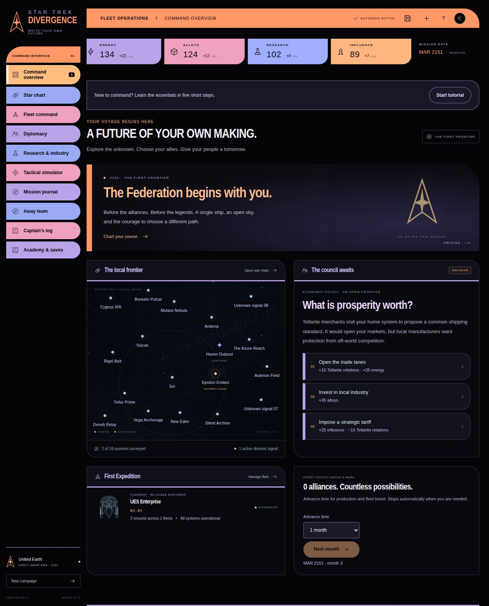
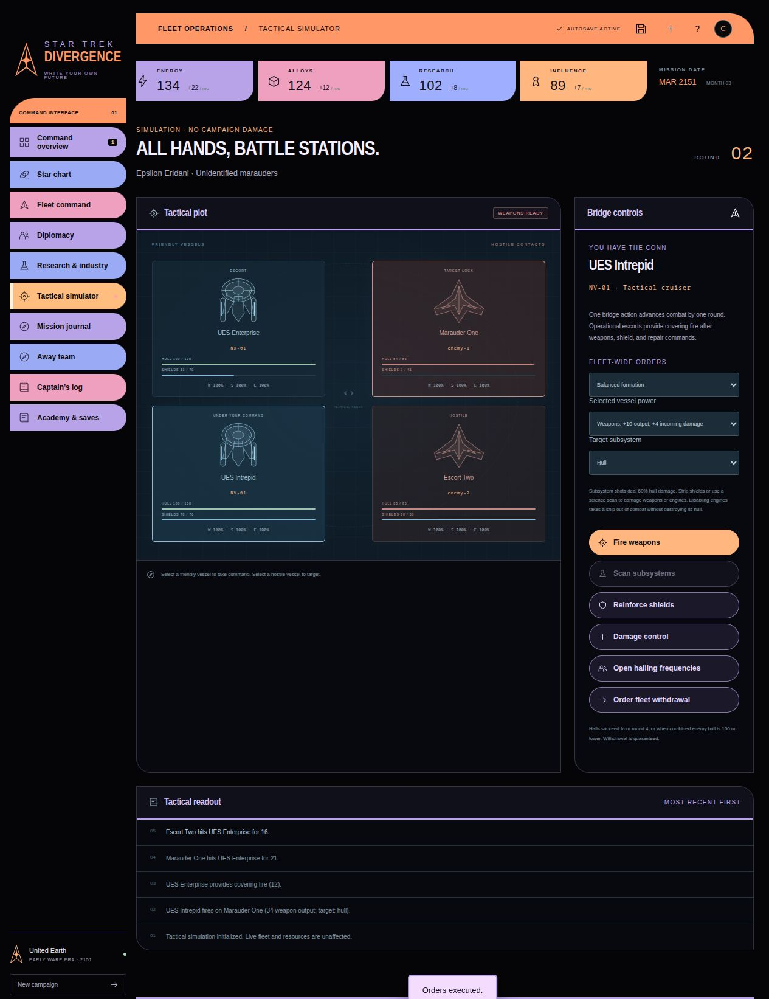

> **Made entirely with ChatGPT, with concepts and ideas by HUHman.**

<div align="center">

# Star Trek: Divergence

### The stars are familiar. The future is yours.

**A text-driven strategy game about exploration, civilization, and the choices that change history.**

[**Download & play**](https://github.com/HUHman416/StarTrekDivergence/releases/latest) · [What's new in v0.3](docs/releases/v0.3.md) · [Project vision](docs/PROJECT_MEMORY.md) · [Report an issue](https://github.com/HUHman416/StarTrekDivergence/issues)

**ALPHA v0.3** · Single-file browser game · Offline play · Local saves

</div>



## Choose who your people become

Begin with **United Earth in 2151**, before the Federation's founding. Explore nearby systems, manage your resources, and decide whether to build a federation, a league of independent worlds, or a centralized frontier authority.

Your allies and enemies are yours to choose. A Klingon alliance is possible. A disagreement with Vulcan can change your course. The founding charter reflects your decisions and the partners you bring to the table.

## Play in under a minute

1. Open the [latest release](https://github.com/HUHman416/StarTrekDivergence/releases/latest).
2. Download **`StarTrekDivergence-v0.3.html`**. The ZIP is optional and includes the same game plus a quick-start guide.
3. Double-click the HTML file, or drag it into a modern browser.
4. Select **Start tutorial**. Prefer to explore? Choose a council response, then click **Next month**.

**No installation, account, or development tools are required to play the release.** Keep the HTML file on your computer; it contains the interface, game rules, and visual assets.

The guide is optional and can be skipped or replayed from **Academy & saves**.

## What you can do

| At your command | In the game |
|---|---|
| **Shape your civilization** | Make six founding decisions and choose your charter. Continue playing afterward. |
| **Make your fleet your own** | Rename ships, set unique registry numbers, and customize fleet names and designations. |
| **Organize independent fleets** | Command up to three fleets, five ships per fleet, and twelve ships overall. Transfer vessels when fleets meet. |
| **Explore with purpose** | Visit 18 systems, scout for six research discoveries, complete field projects, escort convoys, and patrol. |
| **Make first contact** | Meet civilizations at their home systems or when their delegations visit your territory. Diplomacy opens after contact. |
| **Lead an away team** | Explore six sites in a first-person grid view. Move, scan, preserve discoveries, or recover materials. |
| **Compare your options** | Compare all four ship designs and every owned vessel, including current upgrades, condition, roles, and commissioning costs. |
| **Manage the unexpected** | Five event types have a 35% chance to occur each month. Decide how to respond. |
| **Set the pace** | Advance 1, 3, 6, or 12 months, with automatic stops for decisions, arrivals, first contact, and reports. |
| **Live with your decisions** | Discover four branching missions. Their consequences arrive two months later and can reflect earlier choices. |
| **Negotiate your future** | Exchange envoys, establish trade and alliances, answer aid requests, negotiate counteroffers, and earn favors. |
| **Develop your economy** | Manage energy, alloys, research, and influence. Build infrastructure and improve your ships. |
| **Take the bridge** | Command individual vessels, select targets, direct fleet formations, allocate power, and disable enemy subsystems. |
| **Find another way out** | Hail an opponent or withdraw. Combat does not require destroying every enemy hull. |

### A new command interface

The orange elbows, pastel navigation segments, dark displays, and rounded controls take visual direction from HUHman's [LCARS Command Interface](https://github.com/HUHman416/LCARS-Command-Interface). Game screens remain keyboard-accessible and adapt to phone, tablet, and desktop widths. The UI is an original CSS implementation; it does not require the reference project's desktop services.

### Leave orbit. Lead the team.

Scout **Mutara Nebula, Cygnus Rift, Rigel Belt, New Eden, Silent Archive, or Haven Outpost**. With a fleet in orbit, choose **Deploy away team** from the system briefing. Use **W/A/S/D**, arrow keys, or the on-screen buttons to move and turn. Approach a numbered scanner marker, scan the object, and choose what to do. **Recall away team** returns to the campaign; completed objectives are retained.


Survey discoveries unlock new research. Completing the Silent Archive and Haven away missions unlocks hull-lattice and field-medicine research. Four additional destinations offer one-time field projects for research, energy, alloys, or influence.

### A vessel for every mission

| Role | Strength |
|---|---|
| **Explorer** | A balanced platform for first contact and fleet command. |
| **Tactical cruiser** | Strong hull and weapons for demanding engagements. |
| **Science vessel** | Extra survey research and scans that expose subsystems through shields. |
| **Support tender** | Repairs allied hulls in battle and improves convoy escort returns. |



### Combat at your pace

Battles are **turn-based**. Select a friendly vessel, designate an enemy target, choose a formation and power setting, then give a bridge command. Weapons, shield reinforcement, repairs, scans, and hails advance combat; changing your selection does not.

Practice in **Tactical simulator** without damaging your campaign fleet. For a live encounter, move a fleet to the distress signal first. Damage from a real battle stays with your ships until repaired. Disabling an enemy's engines takes it out of combat while preserving its hull.

## Keep your campaign between versions

The game autosaves locally, including during combat and away missions. Browser storage may be tied to the browser, website, or downloaded file's location.

**Before updating or moving the game:** open **Academy & saves → Export campaign**. Keep the JSON file. Open the new version and import it from the same screen. The importer shows the incoming faction, month, and fleet size before replacing anything. Invalid files leave your current campaign intact.

<details>
<summary><strong>Bringing a campaign forward from the original v0.1</strong></summary>

The importer understands the original save format and adds the new fleet, registry, mission, and diplomacy fields automatically. However, the original v0.1 did **not** include an export button.

Keep a backup of the old HTML file. Replacing the game at the same file path in the same browser may preserve its local save, depending on the browser. Opening a differently named file does not guarantee that your save transfers.

For a reliable manual backup, open the old game and use the browser's developer tools to copy the local-storage entry named `divergence.campaign.v1` into a `.json` file. Import that file into the current version. This copies only your game state; no account or credentials are involved.

</details>

**v0.2 campaigns are supported:** export from the old game and import here. Existing contacts, wars, treaties, ship names, and registries remain intact; the expanded frontier is added around your progress. New campaigns begin with only a visiting Vulcan delegation known.

## Where this is going

- **Now:** a playable Federation-focused alpha with an LCARS interface, expanded exploration, first contact, away teams, ship comparisons, monthly events, and tactical command.
- **Next:** playtesting, balancing the economy and combat, richer missions, and deeper faction-specific origins.
- **After the look and gameplay are established:** native **Linux and Windows builds**.
- **After the base game is release-ready:** mod support and an intuitive **built-in mod manager**.

This alpha uses an 18-system schematic map and a compressed alternate-history founding chapter. Klingon and Romulan starts have faction bonuses but currently share the prototype story structure. The economy, diplomatic responses, and combat are early systems for iteration. Away missions use a simple first-person, grid-based corridor renderer with six themed scenarios sharing a layout; they are an initial exploration prototype, not a free-roaming 3D game. There is no multiplayer, finished strategic opponent AI, native installer, or mod loader yet.

The [project memory](docs/PROJECT_MEMORY.md) records HUHman's requirements, decisions, and future ideas for subsequent development sessions.

## Development

The game uses plain JavaScript, HTML, and CSS. Simulation rules are separate from the interface, with no server-side game logic or application dependencies.

**Requirements:** Node.js 22+ and Python 3.

```sh
npm run dev       # Serve the source game on port 5173
npm test          # Simulation and save-compatibility tests
npm run check     # JavaScript syntax checks
npm run build     # Versioned HTML, ZIP, and SHA-256 checksums in dist/
```

Serve the source over HTTP; `index.html` imports separate modules. Downloadable release HTML files have their dependencies embedded and are designed to open directly.

For browser checks, install Python Playwright and Chromium, start the development server, then run:

```sh
python3 tests/browser_smoke.py
python3 tests/frontier_browser.py
python3 tests/bundle_smoke.py    # Run npm run build first
```

Set `CHROMIUM_PATH` if the browser is not at `/usr/bin/chromium`. Set `DIVERGENCE_TEST_URL` to override the default test server address. Browser test artifacts are written to `/tmp/divergence-browser` by default. These are optional development tools, not requirements for playing.

| Location | Purpose |
|---|---|
| `src/game.js` | Campaign simulation, missions, fleets, diplomacy, combat, and save migration |
| `src/app.js` | Interface, tutorial presentation, browser storage, and file import/export |
| `src/styles.css` | Responsive visual design |
| `tests/` | Simulation tests, legacy-save fixture, and browser walkthroughs |
| `scripts/` | Single-file packaging and release artifact generation |
| `.github/workflows/release.yml` | Validation and tag-triggered GitHub releases |
| `docs/PROJECT_MEMORY.md` | Durable project vision and user ideas |

### Release convention

The original **`Alpha`** tag and **Star Trek Divergence v0.1** release are preserved. New releases use versioned alpha tags such as **`Alpha-v0.2`**, with titles such as **Star Trek Divergence v0.2**. Pushing a matching tag runs validation, builds the artifacts, and publishes the release with its versioned notes. An explicitly authorized release can also be published by a main-branch commit containing `[release]`; the workflow creates the version tag only after all validation passes. Existing releases are never overwritten. The package version, game version, tag, and notes must agree.

### Validation

The v0.3 simulation suite covers founding choices, diplomacy, combat, independent fleets, legacy saves, contact visibility, exploration research, all six away sites, one-time rewards, monthly events, and safe multi-month advancement. Browser walkthroughs cover existing gameplay and the new frontier systems. Responsive checks cover all ten screens at 390, 768, and 1440 pixels. The release bundle has a separate offline-play and external-asset check.

The managed test browser blocks direct `file://` navigation, so automated bundle checks use HTTP. HUHman successfully playtested the original standalone HTML; direct opening of each new release should remain part of user playtesting.

---

**Concepts, ideas, and direction:** [HUHman](https://github.com/HUHman416)

**Implementation and development:** ChatGPT

*An unofficial Star Trek fan project. Not affiliated with or endorsed by the owners of Star Trek.*
